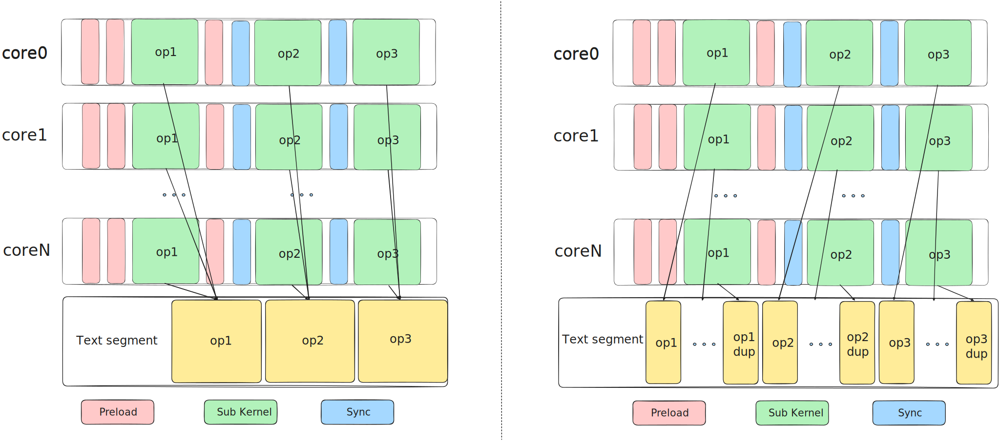
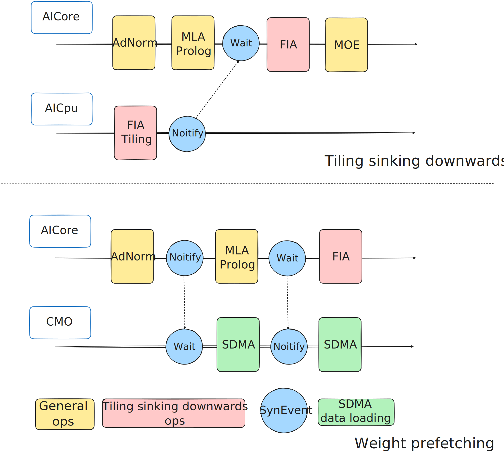

# SuperKernel

## Introduction

SuperKernel is a scheduling optimization technology for network graph models. The core idea is: based on prior information of operators in the network graph model (such as operator type, predecessor-successor dependency relationships, and so on), combined with Just-In-Time (JIT) compilation capability, the entire network model is recompiled into a single operator, significantly reducing operator scheduling overhead. Through ICache preload, Early-Start, synchronization optimization, and sub-kernel splitting optimization methods, performance is further improved.

<div align="center">
   
</div>

***

The original design intent of SuperKernel is to fuse multiple sub-operators into one SuperKernel, saving N-1 operator scheduling overhead. However, to maintain execution order between sub-operators, full-core synchronization operations are typically inserted, which to some extent weakens the benefits of scheduling optimization. Thanks to obtaining all prior information of sub-operators during the compilation phase, SuperKernel can implement more deep optimizations on this basis.

**1. ICache Preload Optimization**

After SuperKernel fuses all operators, its binary size is large. When the system loads the operator, it typically only prefetches entry instructions, causing a large number of instructions inside SuperKernel not to be preloaded into the instruction cache (ICache), resulting in high ICache Miss. Therefore, we introduce the ICache Preload mechanism: preload the code segments of subsequent sub-operators before the current sub-operator starts execution, effectively reducing ICache Miss when subsequent operators execute.

<div align="center">
   
</div>

**2. Early-Start Optimization**

In conventional scheduling, subsequent operators can only start after all predecessor operators complete execution. However, the last instructions of most predecessor operators are MTE data transfer instructions, while the starting instructions of subsequent operators are typically initialization scalar instructions unrelated to input data. Since these two types of instructions belong to different computing units, they have conditions for concurrent execution. Early-Start technology inserts a Set synchronization point before the transfer instruction of the predecessor operator, and inserts a Wait synchronization point after the initialization instruction of the subsequent operator, thereby achieving concurrent execution of partial instructions of two sub-operators, improving overall execution efficiency.

**3. Synchronization Optimization**

To ensure correct execution order, SuperKernel inserts full-core synchronization operations between scheduling of each sub-operator. For Kernel Type Mix 1:2 mixed type operators, complete full-core synchronization needs to wait for both Vector core and Cube core of all Aicore to complete synchronization. SuperKernel can identify the type of each sub-operator during compilation, therefore can customize synchronization range based on the Kernel Type of predecessor and successor sub-operators. For example, for consecutive Vector operators, only full Vector core synchronization is needed. Through fine-grained control of synchronization range, synchronization overhead between sub-operators can be effectively reduced.

**4. Sub-Kernel Splitting**

In multi-core systems, when multiple computing cores execute the same code segment, they concurrently access the same instruction address in memory. This concurrent access to the same address forms a serialized access queue at the shared L2 Cache level, causing resource contention and weakening the performance gains from multi-core parallelism. To solve this problem, SuperKernel copies sub-kernel code into multiple copies, enabling different cores to execute based on different physical addresses mapped by core ID. This method effectively alleviates contention for the same instruction address by multiple cores, significantly improving operator execution efficiency.

<div align="center">
   
</div>

Additionally, SuperKernel supports memory semantics-based Notify and Wait events to adapt to Tiling sinking and Weight prefetch scenarios. Tiling sinking operators refer to operators where Tiling calculation depends on predecessor operator output results. To avoid frequent interaction between host and device, Tiling calculation is deployed on AICpu for execution. If SuperKernel fuses predecessor operators of the Tiling operator, it needs to notify AICpu to start Tiling calculation through Notify event after predecessor operator execution completes. If the Tiling sinking operator itself is fused, it needs to wait for AICpu to complete Tiling calculation through Wait event before executing Device-side calculation. Weight prefetch uses CMO tasks to call dedicated hardware unit SDMA to preload data into L2 Cache to improve computational efficiency. Collaboration between SDMA and Aicore is achieved through memory semantics Notify/Wait events.

<div align="center">
   
</div>

***

## Directory Structure

```
super_kernel/
├── docs                   # documentation introduction
├── examples               # example scripts or Notebooks demonstrating typical usage
├── scripts                # script path
├── src                    # business code entry, modules divided by function
│   └── superkernel        # SuperKernel business code
├── tests                  # test project directory
│   ├── st                 # System Test
│   ├── ut                 # Unit Test
│   └── utils              # common validation and utility functions
├── CMakeLists.txt         # CMake configuration file
├── pyproject.toml         # project metadata and packaging configuration
├── README.md
└── requirements-dev.txt   # python dependency configuration file
```

## Build and Installation

Refer to [Build Instructions](../docs/en/build.md#build-from-source).

## Developer Guide

Developers please refer to "[Developer Guide](../docs/en/super_kernel/developer_guide.md)" to understand code implementation, testing methods, and other information.
