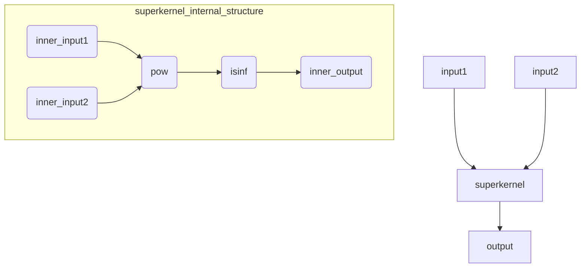

# super_kernel Minimal Sample

## Use Case Function:

This sample demonstrates how to use super_kernel to complete operator fusion, including operator fusion definition, compilation, execution, and other steps.
Core features:
- Simple dependencies, only depends on AscendC and runtime environment.
- Uses Python wrapper for underlying C interfaces, simplifying development workflow.

## Directory Structure
```
├── super_kernel_runtime_ascendc_only             # directory
   └── superkernel_runtime_ascendc_basic.py       # main entry, flow includes sub-kernel compilation, superkernel compilation, memory allocation, loading execution, and so on
   └── compile_sk.py                              # compile sub_kernel, super_kernel operators
   └── utils.py                                   # utility functions

```

## Use Case Introduction



This use case demonstrates super_kernel basic functionality through compile-time dependency on ascendc and runtime dependency. Main steps:
- 1. Initialization
- 2. Compile sub_kernel, compile super_kernel, set sub-kernel topology relationship in super kernel for memory allocation
- 3. Memory allocation, input data construction
- 4. Kernel loading
- 5. Launch execution, including args layout and so on
- 6. Print output, output result validation
- 7. Resource cleanup and release, including memory, kernel, stream, and so on

> Explanation:
> 1. Sub-kernel topology relationship is represented through strings. For example, if pow output is isinf input, then pow output and isinf input use the same string representation.
> 2. When allocating memory, use strings to express same memory addresses.
> 3. When launching args, layout follows [pow_in1, pow_in2, pow_ws, isinf_in1, isinf_out1, isinf_ws]

## Execution Command

```
python3 superkernel_runtime_ascendc_basic.py
```

## Expected Execution Result

After execution, print shows success:
```
execute sample success
```